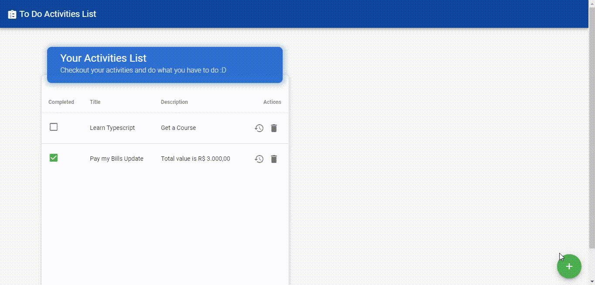

# Vue Activities List
A very simple "to do list" app, that use local storage to persist the to do items. This project was created to gain more knowledge about Vue.js, working primarily with transitions, mixins and Vuetify plugin.

## Project setup
```
npm install
```
### Compiles and hot-reloads for development
```
npm run serve
```
### Compiles and minifies for production
```
npm run build
```
### Lints and fixes files
```
npm run lint
```
### Customize configuration
See [Configuration Reference](https://cli.vuejs.org/config/).

### Usage Example

